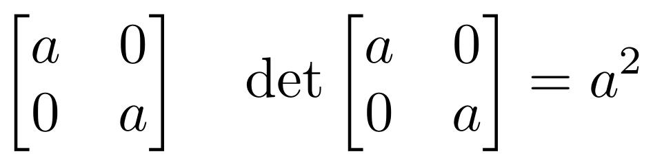
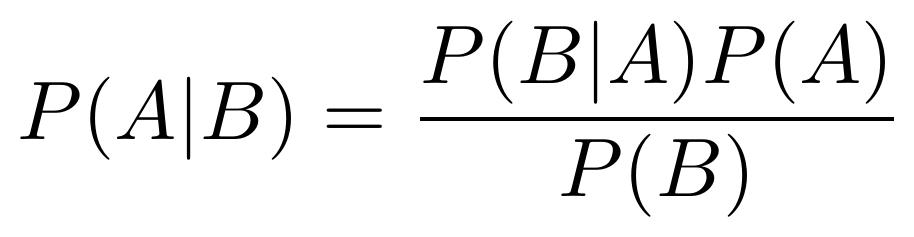
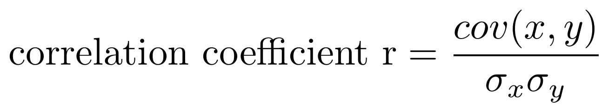

## natural language to latex
this tool converts user input for any mathematical equation or expression into its latex equivalent making use of LLM. the latex obtained is converted to a jpeg file and saved in the `/output` folder - thus the user can make use of the image or just the plain latex text obtained

## features
- Converts natural language mathematical expressions and equations to LaTeX
- Generates jpeg images of LaTeX expressions

## Example
**Input:** "integral of x squared from 0 to 1"

**Output:**
- LaTeX: `\int_0^1 x^2 \, dx`
- Image: (image preview)

examples for the images generated using this project have been added within the `examples` folder
Given below are some images that were generated using this project

1. a 2x2 matrix with its determinant
    

2. bayes theorem
    

3. correlation coefficient r
    

## installation
run the following command 
```git
git clone https://github.com/Amm4r03/natural-language-to-latex
```

## requirements
install python packages using the following command :
(packages mentioned in `requirements.txt`)

```cmd
pip install -r requirements.txt
```

this project also makes use of `pdflatex` which comes installed with MiKTeX and can be downloaded from [here](https://miktex.org/howto/download-miktex)

## Usage
- When running the project for the first time, start by getting your API key up and running from [cohere](https://dashboard.cohere.com/api-keys) which provides fairly decent LLM usage under the free tier
- run the [start_here.py](start_here.py) and enter the API key obtained from cohere to get your API key saved to the .env file 
- run the [app.py](app.py) file
- the output images obtained will be stored in the `/output` folder and the latex obtained for the expression will be displayed in the terminal